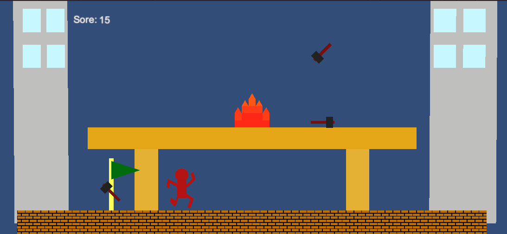

ゲーム制作技術総合実習 個人ワーク
（Circle, Triangle, Squareを使用した2Dゲーム）

# 上からの落下物に気をつけろ！ドキドキ旗集め

## ゲームの内容
上から降ってくる炎やハンマーを避けて旗を集めるゲームです。一度でも落下物に触れたらアウト。あなたは一体何点取れるかな？

## 操作説明
- 矢印キーを押して移動
- 旗に触れたら得点になる
- 落下物に触れたらゲームオーバー